# RetailMaster POS System

A comprehensive Point of Sale (POS) system with multi-branch support, inventory management, online ordering, and role-based access control.

## 📸 Screenshots

### Landing Page
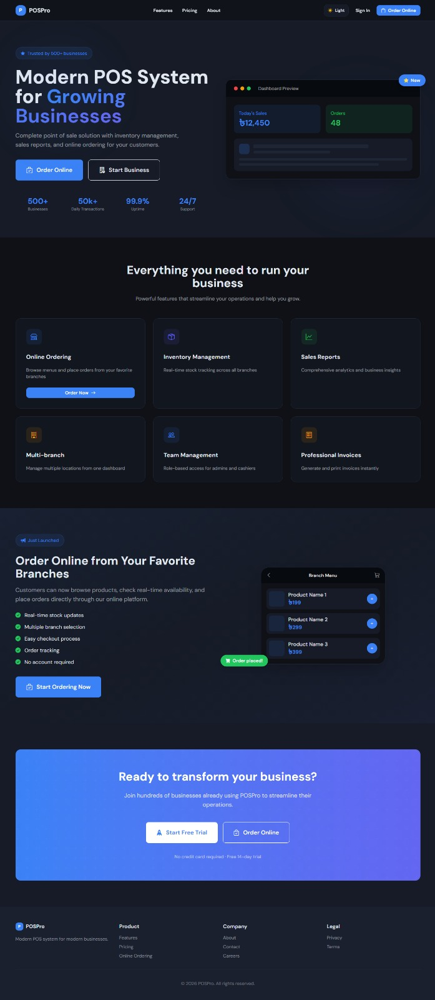

### Sign In
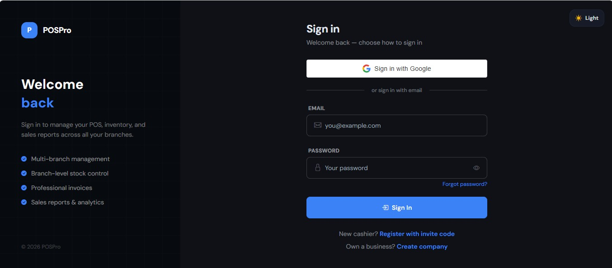

### Sign Up
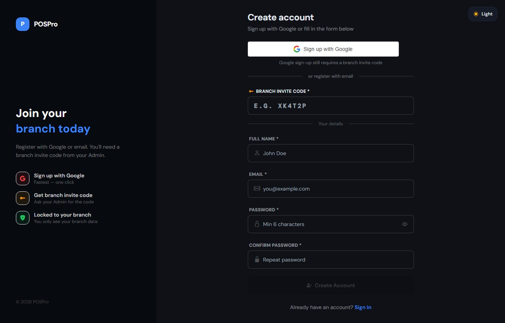

### Company Creation
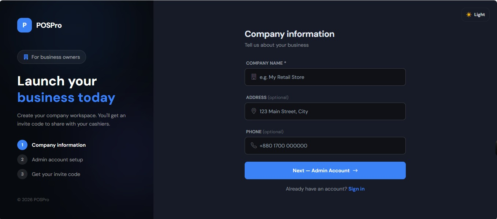

### Company Details
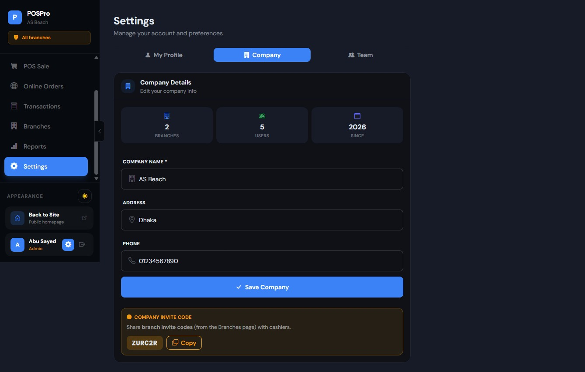

### Dashboard
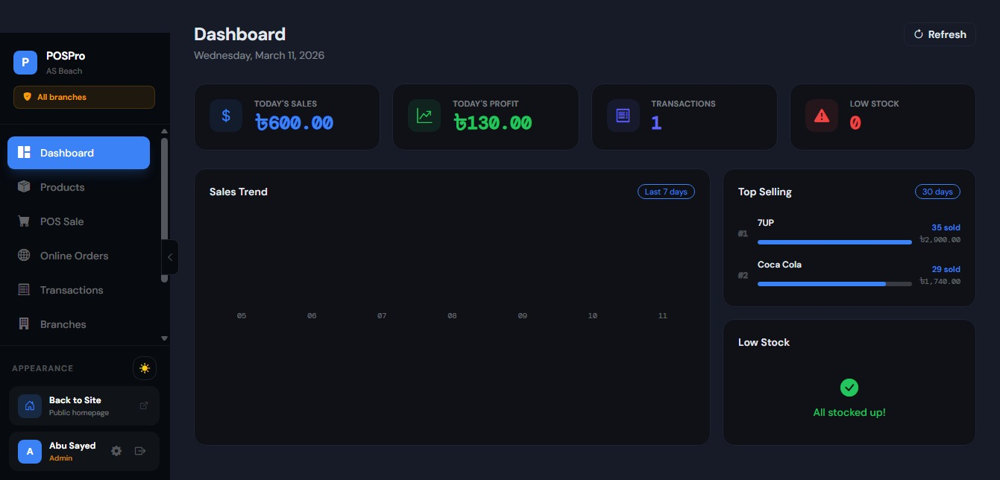

### Products
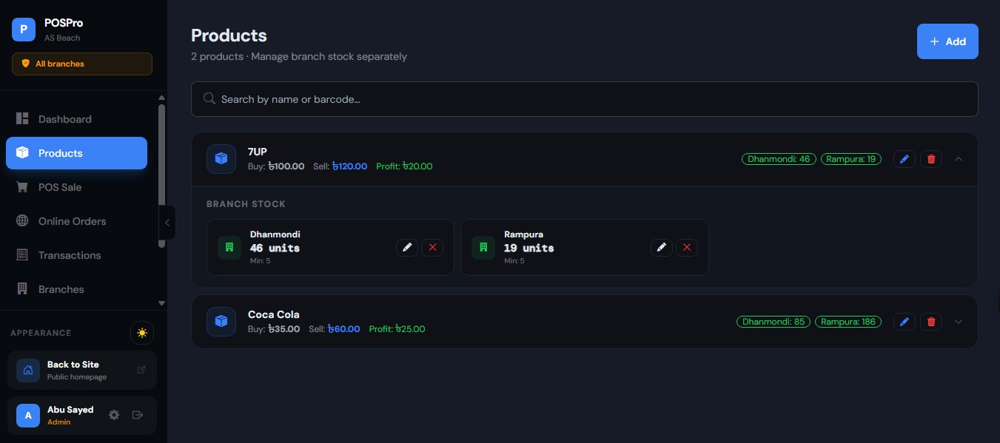

### POS Sale
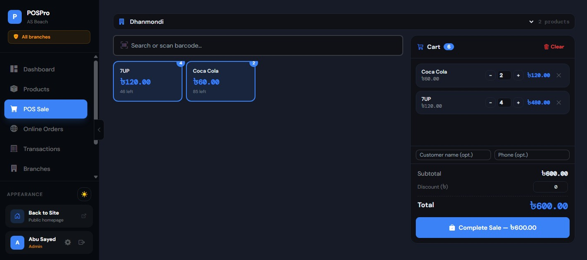

### Transactions
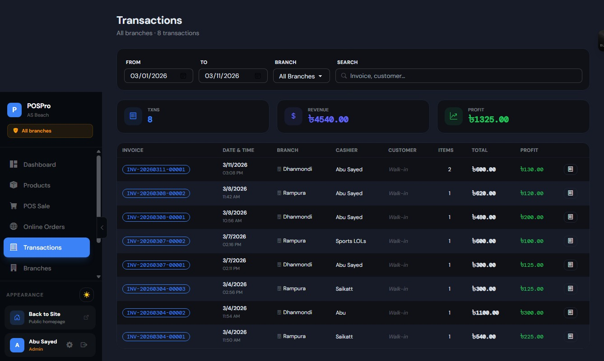

### Invoice Print
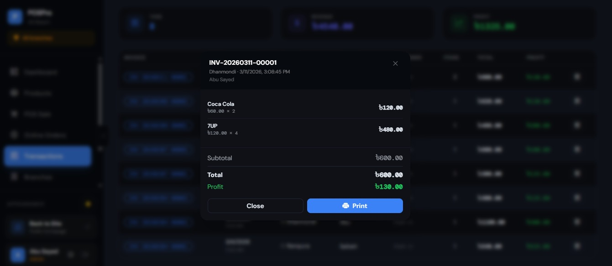

### Online Order
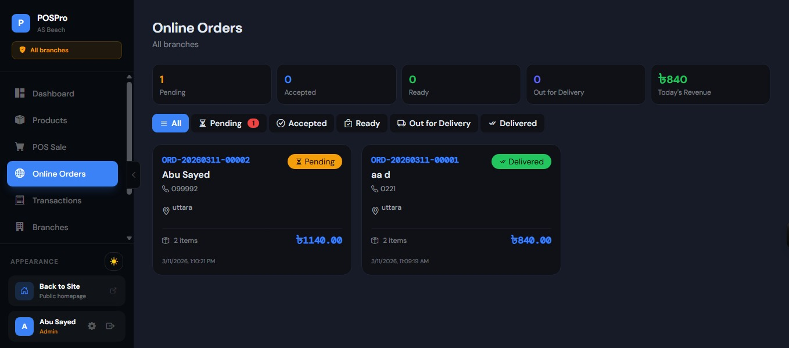

### Online Order Branch


### Order Details
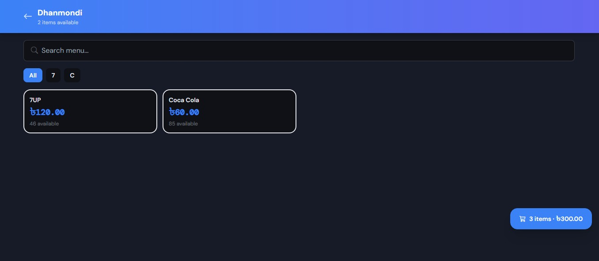

### Order Details 2
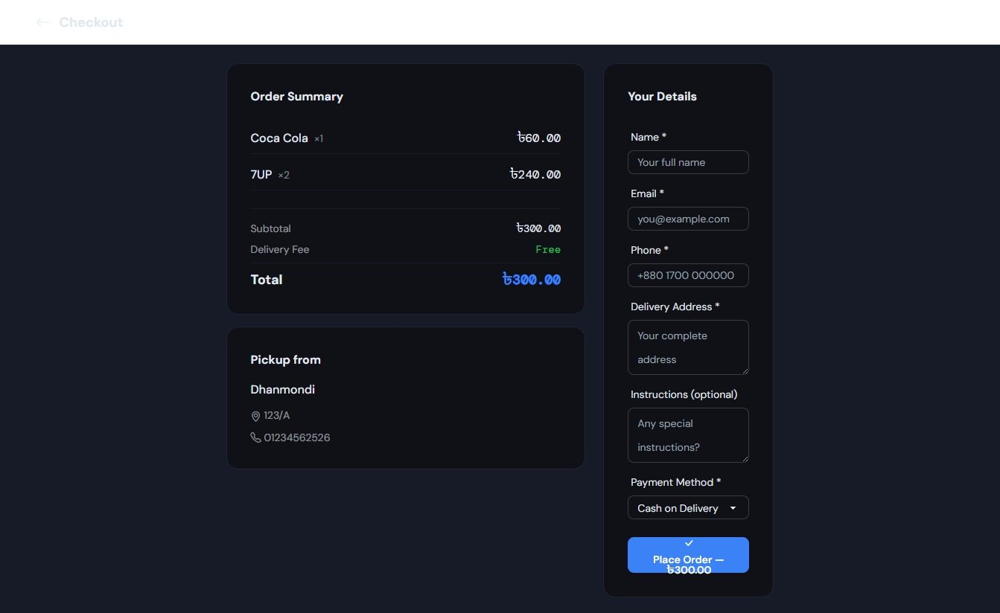

### Order Approve
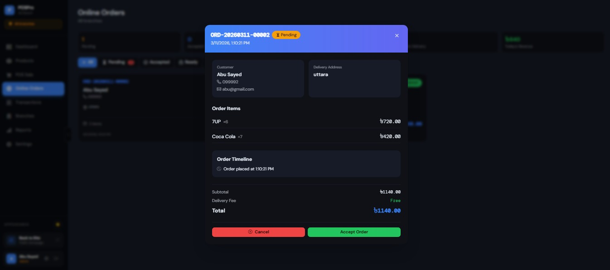

### Branches
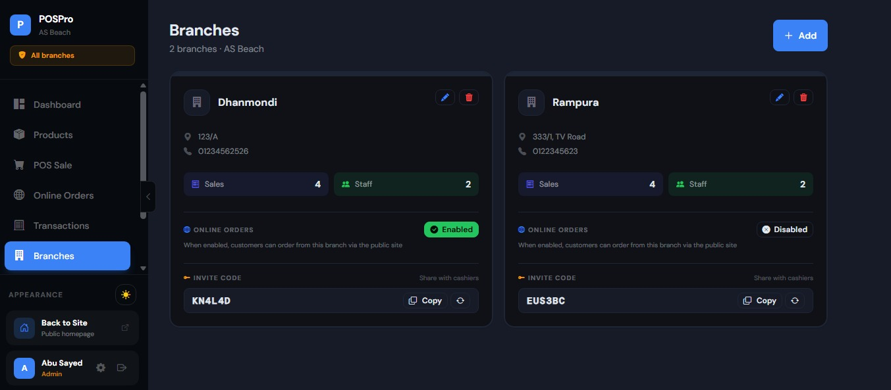

### Reports
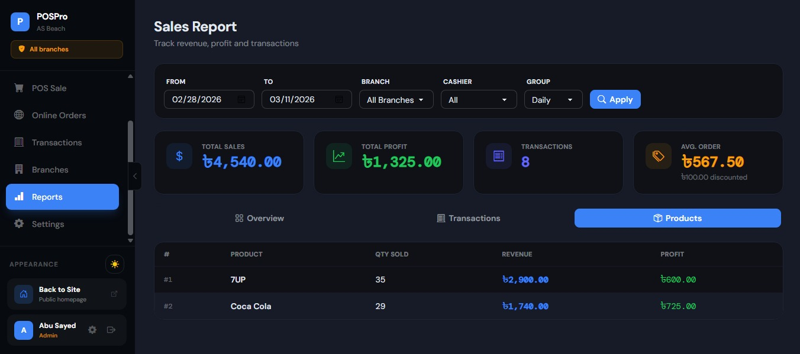

### Profile
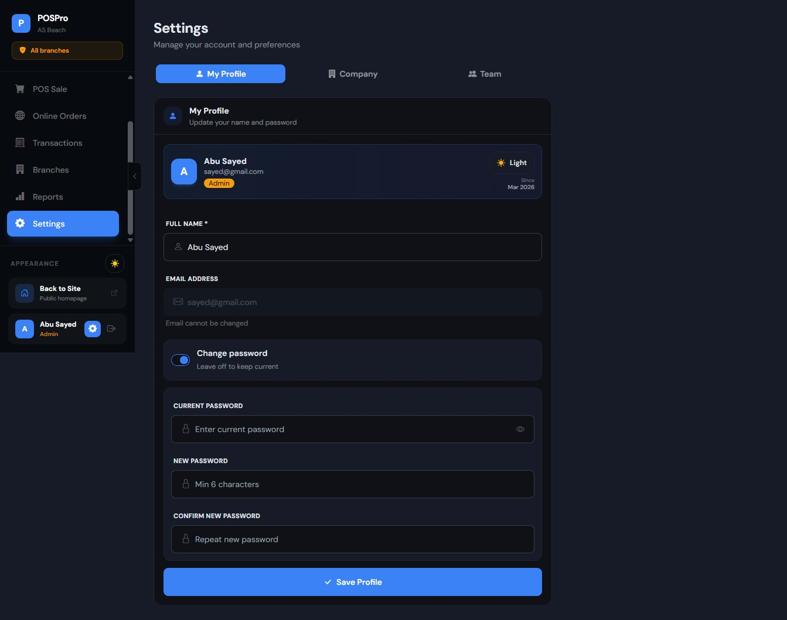

### Settings
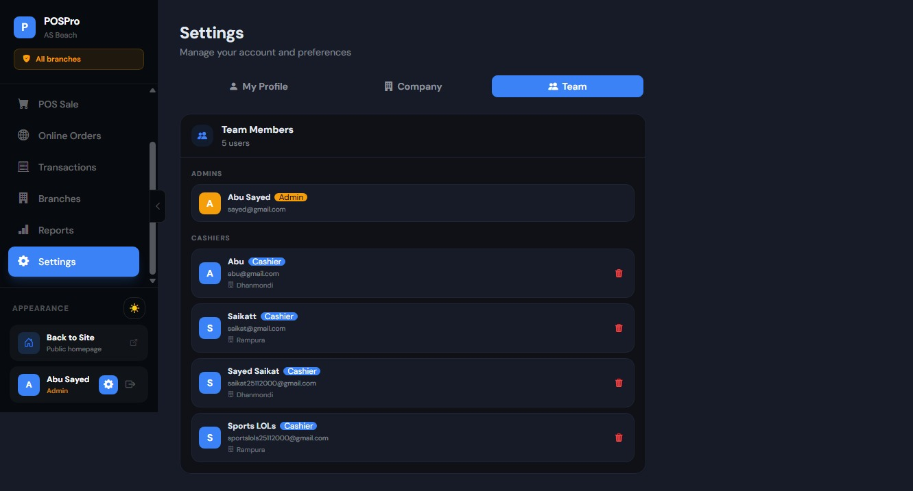

---

## 🚀 Features

### Core POS Features
- **Multi-branch Management**: Create and manage multiple branches under one company
- **Role-based Access**: Admin and Cashier roles with different permissions
- **Product Management**: Central product catalog with branch-specific inventory
- **Sales Processing**: Fast and intuitive POS interface for cashiers
- **Invoice Generation**: Professional PDF invoices with print support
- **Sales Reports**: Comprehensive reports with filters and analytics
- **Dashboard**: Real-time KPIs, low stock alerts, and sales trends

### Online Ordering System
- **Public Storefront**: Customers can browse products by branch
- **Real-time Inventory**: Live stock availability checking
- **Order Management**: Complete order lifecycle (Pending → Accepted → Ready → Out for Delivery → Delivered)
- **Order Tracking**: Customers can track their orders
- **Branch Selection**: Customers choose which branch to order from
- **New Order Notifications**: Real-time alerts for cashiers

### Authentication & Security
- **JWT Authentication**: Secure token-based authentication
- **Google OAuth**: Sign in with Google integration
- **Password Reset**: Forgot password functionality with email
- **Multi-tenancy**: Complete data isolation between companies

### Inventory Management
- **Branch-specific Stock**: Track inventory per branch
- **Low Stock Alerts**: Automatic notifications when stock runs low
- **Stock Adjustments**: Easy quantity and threshold management
- **Product Catalog**: Central product database with pricing

## 🏗️ Project Structure

### Backend (RetailMaster.API)

```
RetailMaster.API/
├── Controllers/
├── DTOs/
├── Models/
├── Services/
├── Data/
├── Migrations/
└── Program.cs
```

### Frontend (RetailMaster.Client)

```
RetailMaster.Client/
├── public/
├── src/
│   ├── components/
│   ├── context/
│   ├── layouts/
│   ├── pages/
│   │   └── Online/
│   ├── services/
│   ├── App.jsx
│   ├── main.jsx
│   └── index.css
├── .env
├── index.html
├── package.json
├── tailwind.config.js
└── vite.config.js
```

## 🛠️ Technology Stack

### Backend
- **.NET 9.0** - Web API framework
- **Entity Framework Core** - ORM and database access
- **PostgreSQL** - Primary database
- **JWT** - Authentication
- **BCrypt** - Password hashing
- **Google.Apis.Auth** - Google OAuth verification
- **Swagger/OpenAPI** - API documentation

### Frontend
- **React 18** - UI library
- **Vite** - Build tool and dev server
- **React Router DOM** - Routing
- **Axios** - HTTP client
- **Framer Motion** - Animations
- **Tailwind CSS** - Styling
- **DaisyUI** - UI components
- **Bootstrap Icons** - Icon set

## 📦 Installation

### Prerequisites
- [.NET 9.0 SDK](https://dotnet.microsoft.com/download)
- [Node.js 18+](https://nodejs.org/)
- [PostgreSQL](https://www.postgresql.org/)
- [Git](https://git-scm.com/)

### Backend Setup

1. **Clone the repository**
```bash
git clone https://github.com/yourusername/retailmaster.git
cd retailmaster/RetailMaster.API
```

2. **Configure database connection**
   
   Update `appsettings.json` or create `appsettings.Development.json`:
```json
{
  "ConnectionStrings": {
    "DefaultConnection": "Host=localhost;Database=retailmaster;Username=postgres;Password=yourpassword"
  },
  "Jwt": {
    "Key": "your-super-secret-jwt-key-with-at-least-32-characters",
    "Issuer": "RetailMaster",
    "Audience": "RetailMasterUsers",
    "ExpireMinutes": 60
  },
  "Google": {
    "ClientId": "your-google-client-id.apps.googleusercontent.com"
  },
  "Frontend": {
    "Url": "http://localhost:5173"
  },
  "Email": {
    "SmtpHost": "smtp.gmail.com",
    "SmtpPort": "587",
    "SmtpUser": "your-email@gmail.com",
    "SmtpPass": "your-app-password",
    "FromEmail": "your-email@gmail.com",
    "FromName": "RetailMaster"
  }
}
```

3. **Run migrations**
```bash
dotnet ef database update
```

4. **Run the API**
```bash
dotnet run
```
The API will be available at `https://localhost:7000` and Swagger UI at `https://localhost:7000/swagger`

### Frontend Setup

1. **Navigate to client directory**
```bash
cd ../RetailMaster.Client
```

2. **Install dependencies**
```bash
npm install
```

3. **Create .env file**
```env
VITE_API_BASE_URL=https://localhost:7000/api
VITE_GOOGLE_CLIENT_ID=your-google-client-id.apps.googleusercontent.com
```

4. **Run the development server**
```bash
npm run dev
```
The app will be available at `http://localhost:5173`

## 🚦 Usage Guide

### For Business Owners
1. **Create Company**: Sign up at `/create-company`
2. **Add Branches**: Navigate to Branches page and add branches
3. **Add Products**: Add products to catalog and assign stock to branches
4. **Manage Staff**: View and manage users in Settings
5. **View Reports**: Analyze sales data in Reports section

### For Cashiers
1. **Register**: Use branch invite code at `/register`
2. **Process Sales**: Use POS interface to ring up customers
3. **Manage Orders**: Handle online orders in the Orders dashboard
4. **Check Inventory**: View products and stock levels

### For Customers
1. **Browse**: Visit the public site at `/online`
2. **Select Branch**: Choose a branch to order from
3. **Add to Cart**: Select products and quantities
4. **Checkout**: Enter delivery details and place order
5. **Track**: Receive order number for tracking

## 🔑 Key Workflows

### Online Ordering Flow
```
Customer → Select Branch → Browse Products → Add to Cart → 
Checkout → Order Placed → Cashier Accepts → Ready for Pickup → 
Out for Delivery → Delivered
```

### POS Sale Flow
```
Cashier → Select Branch → Scan/Search Products → 
Add to Cart → Apply Discount → Complete Sale → 
Print Invoice → Update Inventory
```

### Inventory Management
```
Admin → Add Product → Assign to Branches → 
Set Stock Levels → Monitor Low Stock → 
Adjust as Needed
```

## 📊 Database Schema

### Core Tables
- **Companies** - Tenant information
- **Branches** - Branch details with invite codes
- **Users** - Staff accounts with roles
- **Products** - Central product catalog
- **BranchProducts** - Branch-specific inventory
- **Sales** - POS transactions
- **SaleItems** - Individual sale items
- **OnlineOrders** - Customer orders
- **OnlineOrderItems** - Order line items
- **PasswordResets** - Password reset tokens

## 🔒 Security Features

- **JWT Authentication** with role-based claims
- **Password Hashing** using BCrypt
- **Multi-tenancy** - Complete data isolation
- **Soft Delete** - Data is never permanently deleted
- **CORS** - Configured for specific origins
- **Input Validation** - All DTOs validated
- **SQL Injection Protection** - Entity Framework
- **XSS Protection** - React's built-in escaping

## 📱 Responsive Design

The frontend is fully responsive and works on:
- **Desktop** - Full sidebar layout
- **Tablet** - Collapsible sidebar
- **Mobile** - Bottom navigation bar

## 🤝 Contributing

1. Fork the repository
2. Create a feature branch (`git checkout -b feature/AmazingFeature`)
3. Commit changes (`git commit -m 'Add AmazingFeature'`)
4. Push to branch (`git push origin feature/AmazingFeature`)
5. Open a Pull Request
